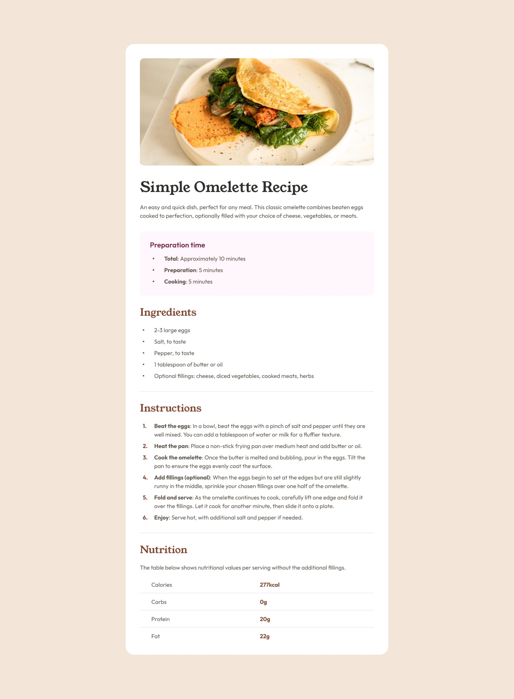
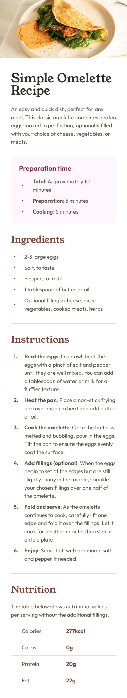

# Frontend Mentor - Recipe Page

This is my solution to the Recipe Page challenge from Frontend Mentor.

## Overview

### Desktop Preview

### Mobile Preview

## Links

- Live Site: https://benevolent-malabi-f8292b.netlify.app/
- Repository: https://github.com/KylarSec/frontend-mentor-recipe-page

## Built With

- HTML5
- CSS3
- Flexbox
- Mobile-First Workflow
- Responsive Design
- CSS Variables
- Local Fonts with `@font-face`

## What I Learned

Through this project, I practiced:

- Building responsive layouts using a mobile-first approach
- Using semantic HTML sections and lists
- Structuring recipe content cleanly
- Styling list markers with `::marker`
- Creating responsive card layouts with media queries
- Improving typography and spacing consistency
- Building nutrition rows using Flexbox

## Author

- GitHub: KylarSec
